# EmpUpdate_Mainframe
This project is developed in mainframe.

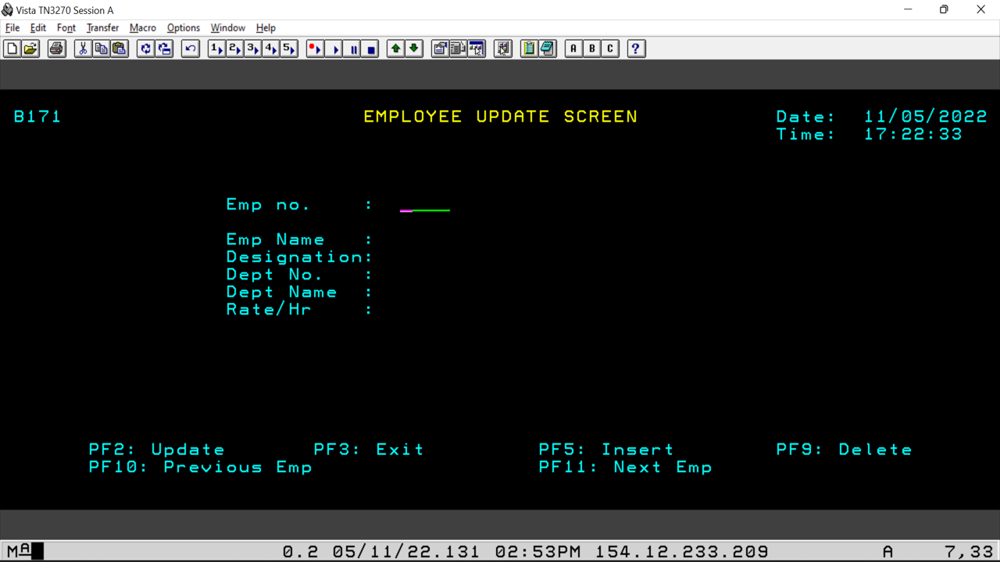

## 📸 Features

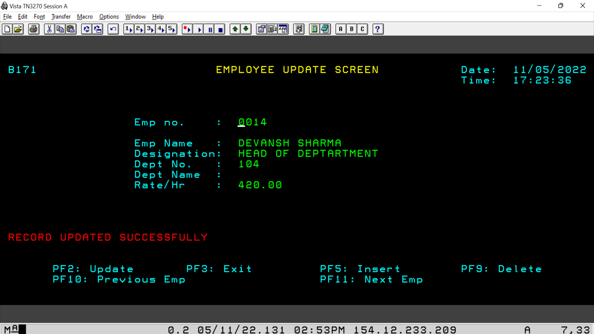

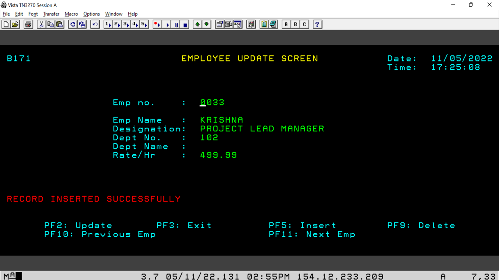

## 📸 Spufi

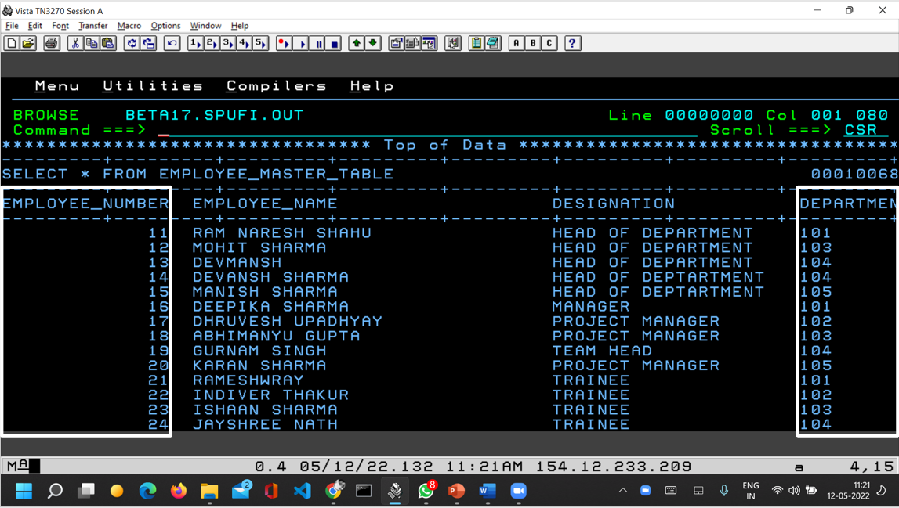

## 📸 Testcases

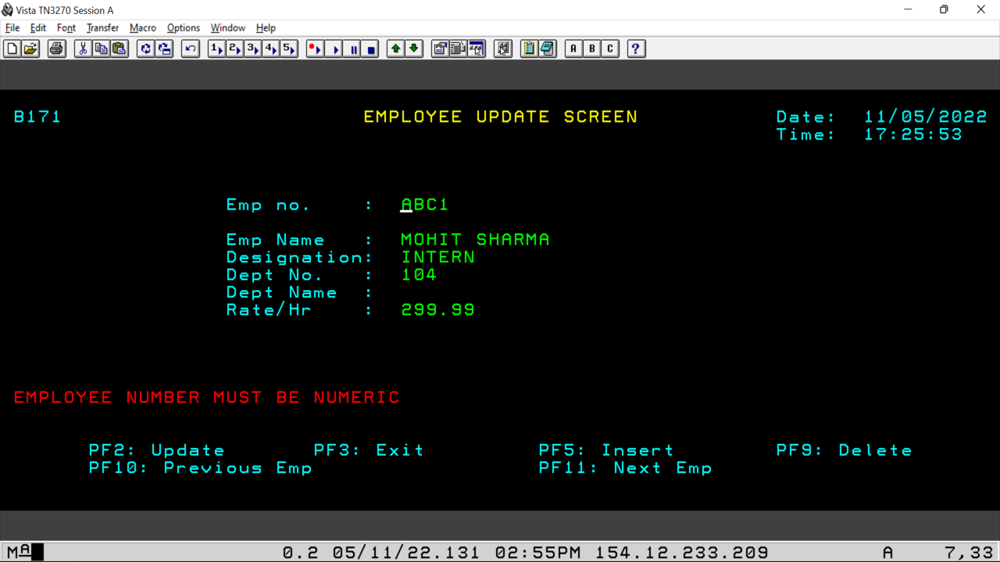

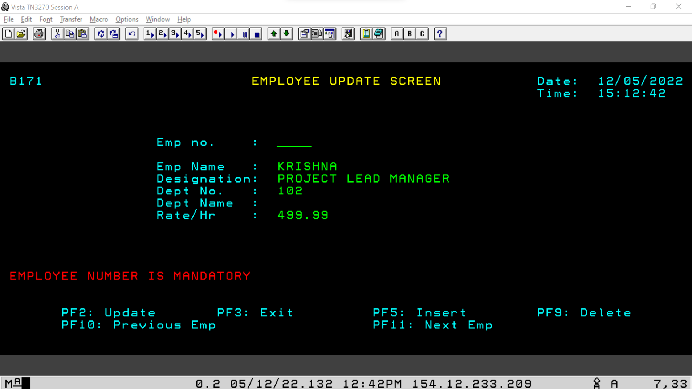

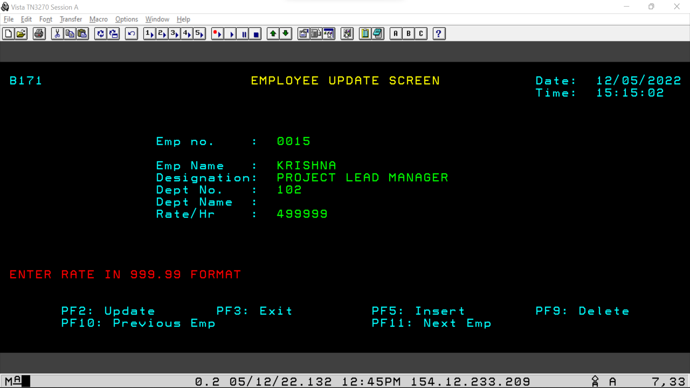

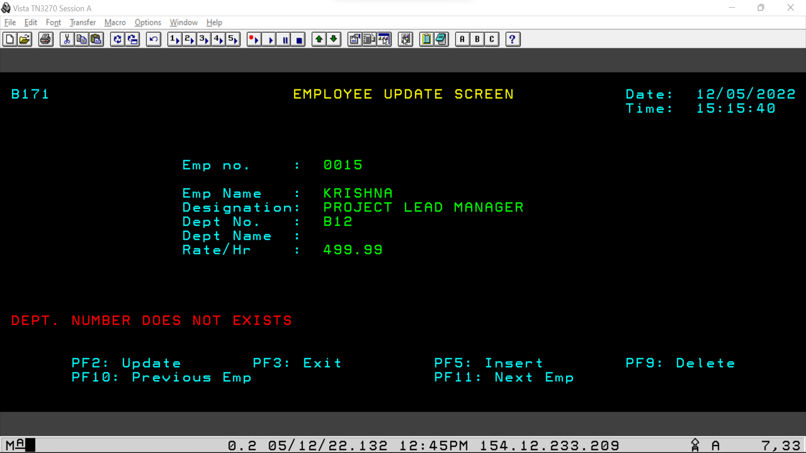

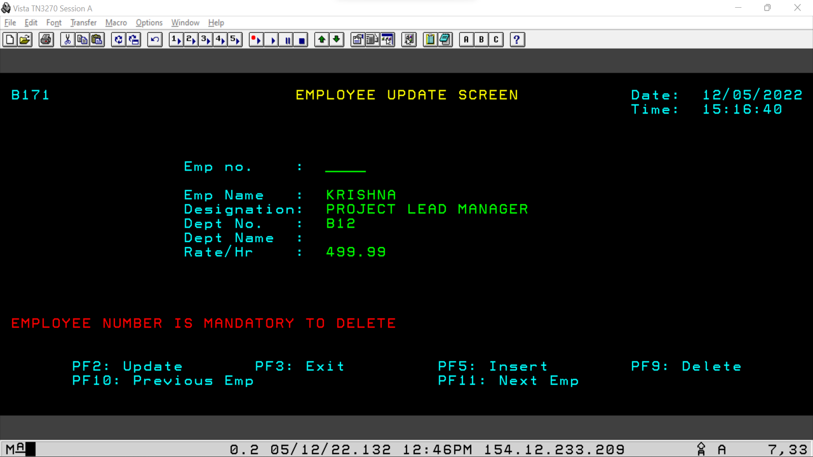

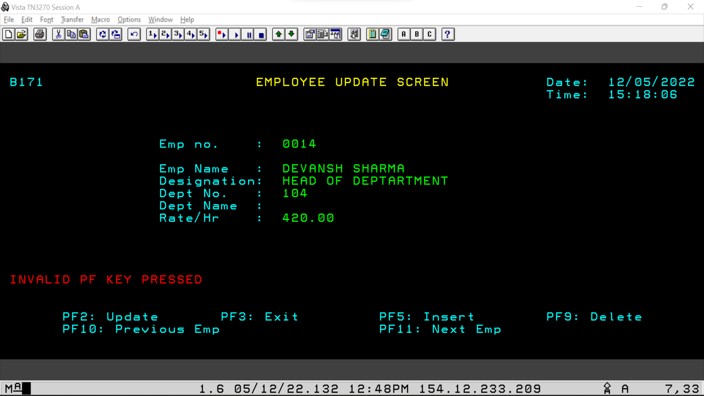

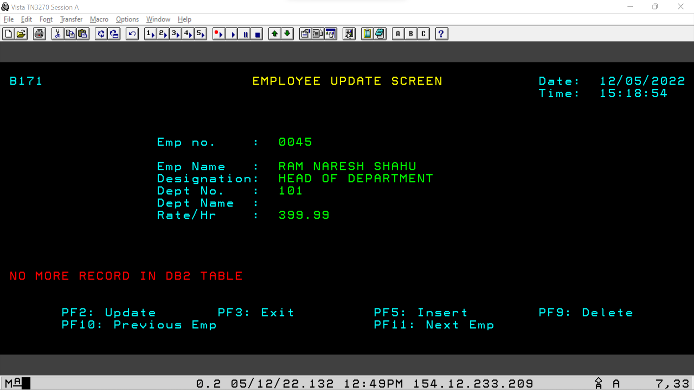

## Built With 🛠
- [COBOL](https://en.wikipedia.org/wiki/COBOL)
- [JCL](https://en.wikipedia.org/wiki/Job_Control_Language)
- [CICS](https://en.wikipedia.org/wiki/CICS)
- [DB2](https://en.wikipedia.org/wiki/IBM_Db2)
  
## Contact
If you need any help, you can connect with me.

Visit:- [Manoj Sharma](https://devmansh.github.io) | [LinkedIn](https://linkedin.com/in/devmansh) | [Instagram](https://www.instagram.com/themohitsharma.in/) | [HackerRank](https://www.hackerrank.com/devmansh)